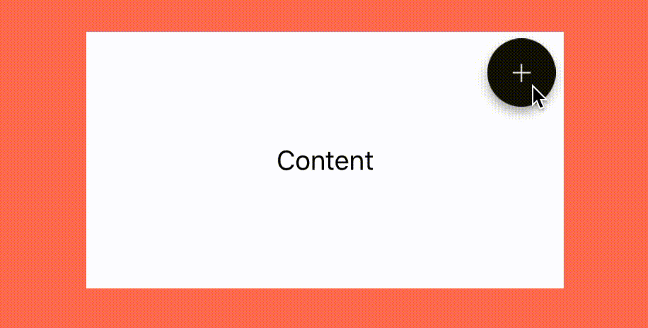

# francetv zoom More Menu Demo

This project is part of [francetv zoom open source projects](https://github.com/francetv/zoom-public) (iOS, Android and Angular).

## Summary

Simple Swift project demonstrating how the more menu was made for **francetv zoom**,
using `CAShapeLayer` and `CABasicAnimation`.



## Usage

Drag the **ContentWithMoreMenuView.swift** and **ContentWithMoreMenuView.xib**
files into your project and add the **BT_Plus** and **BT_Plus_Shadow** images to
your assets.

Then, in a `UIViewController`, create a `ContentWithMoreMenuView`,
set its constraints and add it to your view as follows:

```Swift
override func viewWillAppear(animated: Bool) {

        super.viewWillAppear(animated)
        addContentView()
    }

private func addContentView() {

    let contentMoreView = NSBundle.mainBundle().loadNibNamed("ContentWithMoreMenuView", owner: self, options: nil)[0] as! ContentWithMoreMenuView

    let constraints: [NSLayoutConstraint] = [
        NSLayoutConstraint(item: contentMoreView, attribute: NSLayoutAttribute.Width, relatedBy: NSLayoutRelation.Equal, toItem: nil, attribute: NSLayoutAttribute.NotAnAttribute, multiplier: 1, constant: 300),
        NSLayoutConstraint(item: contentMoreView, attribute: NSLayoutAttribute.Height, relatedBy: NSLayoutRelation.Equal, toItem: nil, attribute: NSLayoutAttribute.NotAnAttribute, multiplier: 1, constant: 161),
        NSLayoutConstraint(item: contentMoreView, attribute: NSLayoutAttribute.CenterX, relatedBy: NSLayoutRelation.Equal, toItem: view, attribute: NSLayoutAttribute.CenterX, multiplier: 1, constant: 0),
        NSLayoutConstraint(item: contentMoreView, attribute: NSLayoutAttribute.CenterY, relatedBy: NSLayoutRelation.Equal, toItem: view, attribute: NSLayoutAttribute.CenterY, multiplier: 1, constant: 0)]

    view.addSubview(contentMoreView)
    view.addConstraints(constraints)
    view.setNeedsLayout()
}
```

## Example

To try the example project, clone the repo, and run the project.

## Requirements

  + ARC
  + iOS 8

## License

  This project is available under the MIT license. See the LICENSE file for more info.
